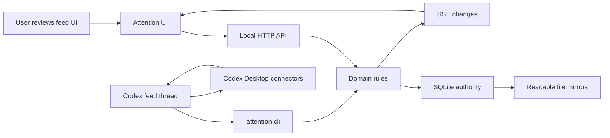

# Attention

Attention is an open-source, local-first feed workspace for Codex Desktop. It gives each feed a
durable local home, a calm review UI, and a JSON CLI that Codex can use to refresh sources, claim
queued work, record results, and safely perform approved actions.

Attention is not a hosted service. The app stores state on your machine. Codex Desktop remains the
agent runtime and owns access to Gmail, GitHub, Slack, browser automation, and other local
connectors.

## Mental Model



The UI and CLI share the same domain rules. Source credentials never live in Attention; they stay in
Codex Desktop.

## Get Started

There are two supported ways to run Attention.

### Use The Binary

Download the latest archive from [GitHub Releases](https://github.com/EveryInc/tend/releases), then
unpack and start it:

```sh
tar -xzf attention-<version>-<platform>-<arch>.tar.gz
cd attention-<version>-<platform>-<arch>
./attention start
```

The binary starts the local server in the background and serves both UI and API from:

```text
http://127.0.0.1:4332
```

Useful runtime commands:

```sh
./attention health
./attention doctor
./attention logs
./attention restart
./attention stop
```

Use foreground mode while debugging:

```sh
./attention start --foreground
```

macOS release binaries are not Apple Developer ID signed or notarized yet. If Gatekeeper warns on
first launch, open the binary explicitly from Finder or remove the quarantine attribute:

```sh
xattr -d com.apple.quarantine ./attention
./attention start
```

### Clone And Extend

Use the source path when you want to inspect, modify, or extend the app:

```sh
git clone https://github.com/EveryInc/tend.git
cd tend
pnpm install
pnpm start
```

Open:

```text
http://127.0.0.1:4321
```

In development, Vite serves the UI on `4321` and proxies `/api` to the local API on `4332`.

## Set Up Codex

Print the setup prompt:

```sh
./attention setup codex
```

When running from source:

```sh
pnpm attention -- setup codex
```

Paste the prompt into a fresh Codex Desktop thread. Use one Codex thread per feed. That feed thread
binds itself with `attention cli feed:bind`, installs or updates one heartbeat automation, drains
queued work before using connectors, and refreshes sources through the local Codex connector
runtime.

Normal manual fallback: wake the feed's home thread and say:

```text
go deal with the feed
```

The thread should list work, claim work, act through local connectors only after a claim, and record
the result through `attention cli`.

## Local Data

Runtime data lives under `~/.attention/` by default:

```text
~/.attention/
  attention.db
  data/
  logs/
  exports/
```

Set `ATTENTION_HOME` to use another runtime root:

```sh
ATTENTION_HOME=.local-attention ./attention start
```

SQLite is the runtime authority. The `data/` directory keeps readable mirrors and immutable raw
evidence snapshots for backup compatibility and local debugging.

Back up and restore:

```sh
attention backup export ./attention-backup
attention backup import ./attention-backup
```

See [docs/DATA.md](./docs/DATA.md) for the full storage map.

## iPhone App

The optional native iPhone app mirrors every configured feed through a private Supabase project.
The Mac remains authoritative: the phone reviews cached projections and records commands, while the
canonical Tend runtime validates and imports those commands through the same domain rules used by
the web app and CLI.

The SwiftUI project, database migration, and production setup are documented in
[docs/IOS.md](./docs/IOS.md).

## CLI Contract

The human-facing CLI is:

```sh
attention version
attention start
attention status
attention doctor
attention setup codex
attention backup export
```

Codex operates feeds through the low-level JSON CLI:

```sh
attention cli state --feed inbox
attention cli work:list --feed inbox --thread <current-codex-thread-id>
attention cli work:claim --feed inbox --thread <current-codex-thread-id>
```

The JSON CLI is the single v0 agent contract for feed setup, work claiming, card/source/sweep
recording, policy revisions, feedback, and runtime inspection. See
[docs/AGENT_CONTRACT.md](./docs/AGENT_CONTRACT.md) and [docs/SKILL.md](./docs/SKILL.md).

## Development

Core checks:

```sh
pnpm check
pnpm build
pnpm attention:build
pnpm attention:smoke
pnpm attention:package
```

`pnpm check` runs typecheck, Oxlint, and Bun tests. `pnpm attention:smoke` validates the compiled
binary against a temporary runtime home.

Build and package a local binary:

```sh
pnpm attention:build
pnpm attention:smoke
pnpm attention:package
```

Seed a scrubbed demo feed:

```sh
pnpm seed:demo
```

## Documentation

- [docs/INSTALL.md](./docs/INSTALL.md): install and first-run details
- [docs/ARCHITECTURE.md](./docs/ARCHITECTURE.md): local runtime and ownership boundaries
- [docs/AGENT_CONTRACT.md](./docs/AGENT_CONTRACT.md): Codex/CLI workflow
- [docs/DATA.md](./docs/DATA.md): storage, mirrors, backup, and restore
- [docs/DEVELOPMENT.md](./docs/DEVELOPMENT.md): local development commands and CI
- [docs/IOS.md](./docs/IOS.md): native iPhone app, Supabase bridge, and device setup
- [docs/RELEASING.md](./docs/RELEASING.md): release lifecycle
- [RUNBOOK.md](./RUNBOOK.md): feed-thread operator guide
- [CAPABILITY_MAP.md](./CAPABILITY_MAP.md): user-visible actions mapped to Codex primitives
- [CONTRIBUTING.md](./CONTRIBUTING.md): contribution expectations
