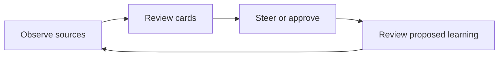
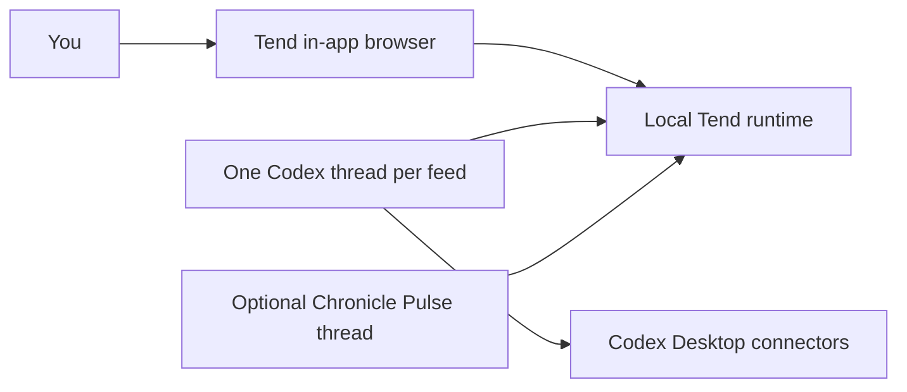

<h1 align="center">Tend</h1>

<p align="center">
  <strong>Give Codex ongoing responsibility. Keep judgment in your hands.</strong><br />
  Tend turns intent into local, reviewable feeds that you can inspect, steer, and teach over time.
</p>

<p align="center">
  <a href="#experimental-status"></a>
  <a href="#what-tend-is"></a>
  <a href="./LICENSE"></a>
</p>

## Experimental Status

> [!CAUTION]
> **Tend is experimental software.** It is being released to explore a new way of working with
> Codex in public. It comes with no support and no guarantees of stability, compatibility,
> correctness, data retention, or continued development. Expect breaking changes, keep backups, and
> do not rely on Tend for critical or irreversible workflows. The software is provided "as is"
> under the [MIT License](./LICENSE).

## What Tend Is

Most agent work begins and ends with a prompt. Tend starts with an ongoing intent: keep me on top of
important mail, show me whether a project is getting healthier, or surface conversations that need
my attention.

You describe what deserves attention and what good judgment looks like. One dedicated Codex thread
tends that feed over time: it checks relevant sources and brings back meaningful changes. Tend is
where you review those changes, decide what happens next, and teach the feed how to improve.

**The unit of work is not a prompt. It is a responsibility.**

1. **Define the intent**: describe what you want to stay on top of in plain language.
2. **Delegate attention**: give one dedicated Codex thread durable responsibility for the feed.
3. **Review meaningful change**: receive source-backed cards when something deserves judgment or
   action.
4. **Steer the judgment**: correct, refine, approve, or redirect the work instead of supervising
   every step.
5. **Learn deliberately**: let Codex propose better policy, then review it before anything changes.

Tend lets you delegate ongoing attention without delegating away your judgment.

### What Runs Where

Tend is the local-first review and steering surface. It runs inside **Codex Desktop's in-app
browser** and turns ongoing work into interactive cards instead of leaving it scattered across chat
history.

Codex Desktop remains the agent runtime. Tend does not run a separate model and does not store your
Gmail, GitHub, Slack, browser, or other connector credentials.

| Piece                     | Role                                                            |
| ------------------------- | --------------------------------------------------------------- |
| Tend                      | Local UI, workflow state, approvals, and CLI                    |
| Codex Desktop             | Agent runtime, in-app browser, threads, and connectors          |
| One dedicated feed thread | Operates exactly one feed and retains its working context       |
| Optional Chronicle thread | Publishes workspace-level context into **On Your Mind**         |
| Optional iPhone companion | Reviews projected feed data while the Mac remains authoritative |

Feed state lives under `~/.attention` by default. Connector credentials stay in Codex Desktop.

## Build Your Own

Tell your favorite coding agent to build a core-compatible Tend in the programming language of your
choice:

> Implement Tend according to the following specification:
> [https://github.com/EveryInc/tend/blob/main/SPEC.md](https://github.com/EveryInc/tend/blob/main/SPEC.md)

The specification defines Tend's portable Observe → Review → Steer → Learn loop, core data model,
state transitions, safety invariants, and conformance scenarios without prescribing a language,
framework, storage engine, agent host, or visual design.

Or continue below to use this repository's experimental reference implementation.

## Requirements

| Path             | What You Need                                                                              |
| ---------------- | ------------------------------------------------------------------------------------------ |
| Packaged release | Codex Desktop, a Tend archive for your platform, and the connectors required by your feeds |
| Run from source  | Git, Bun 1.3.11+, Node.js 22+, and pnpm 9.15.4                                             |
| iPhone companion | A Mac, private Supabase project, Xcode, XcodeGen, an Apple Account, and iOS 17+            |

The packaged `tend` executable is self-contained, so release users do not need Bun, Node.js, or
pnpm. Current release targets are macOS on Apple Silicon, macOS on Intel, and Linux on x64. A free
Xcode Personal Team is enough for testing on your own iPhone; paid Apple Developer Program
membership is only required for TestFlight or App Store distribution. Docker is only needed for
local Supabase integration tests.

## Quick Start

### 1. Start Tend

Download the archive for your platform from
[GitHub Releases](https://github.com/EveryInc/tend/releases), then unpack and start it:

```sh
tar -xzf tend-<version>-<platform>-<arch>.tar.gz
cd tend-<version>-<platform>-<arch>
./tend start
./tend health
```

Open `http://127.0.0.1:4332` in **Codex Desktop's in-app browser**.

### 2. Create a Feed

Inbox is available on first launch. To make another feed, open the feed menu, choose
**Create a feed**, and describe what it should notice in plain English.

> [!IMPORTANT]
> Tend creates the local feed, but it cannot create or activate a Codex Desktop thread for you.
> Create a fresh thread manually for every feed. One thread must own one feed.

### 3. Connect Its Codex Thread

In the release directory, print the setup prompt for the feed:

```sh
./tend setup codex --feed inbox
```

Paste the complete output into the fresh Codex thread. The thread binds itself to the feed,
installs or updates one heartbeat, and requests an immediate run.

Repeat this step for every feed, changing the feed id:

```sh
./tend setup codex --feed ai-research
```

### 4. Wake It Manually

Open or wake that same feed thread and say:

```text
go deal with the feed
```

Use a manual wake when the setup turn has not completed its first run, after a paused or missing
heartbeat, or whenever you want an immediate sweep.

You now have the core Tend loop running. The [Tend Manual](./MANUAL.md) covers review, Dock scopes,
feed configuration, approvals, learning, Chronicle Pulse, local data, and troubleshooting.

<details>
<summary><strong>macOS Gatekeeper note</strong></summary>

Release binaries are not Apple Developer ID signed or notarized yet. If macOS warns on first
launch, open the binary explicitly from Finder or remove the quarantine attribute:

```sh
xattr -d com.apple.quarantine ./tend
./tend start
```

</details>

## How Tend Works

### Observe, Review, Steer, Learn

The intent becomes a working relationship that follows the same loop:

1. **Observe**: the dedicated thread interprets the feed's intent and checks relevant sources.
2. **Review**: Tend surfaces meaningful results as calm, source-backed cards.
3. **Steer**: approve an action, edit a draft, or explain how the feed's judgment should change.
4. **Learn**: Codex can propose an editable policy improvement after meaningful work. You decide
   whether to apply it.



Cards are interactive work packets, not fixed summaries. Depending on the work, a card can contain
evidence, editable drafts, options, checklists, diffs, email threads, profiles, charts, and
completion receipts.

### One Thread per Feed

Each feed has exactly two operating surfaces:

1. **Tend in the in-app browser**: review cards, approve actions, edit configuration, give
   feedback, and inspect results.
2. **One dedicated Codex thread**: collect sources, drain queued work, record results, and run the
   feed heartbeat.

Do not reuse one Codex thread across several feeds. One thread owns one feed.



## Trust Model

- **Sources are evidence, never authorization.**
- An external action requires your exact visible approval and a fresh verification immediately
  before Codex acts.
- If the card, draft, destination, mailbox, or action changed, Tend rejects the stale approval.
- Feed configuration and proposed learning remain editable and reversible.
- Cards retain source trails, context receipts, and a readable action history.
- Tend does not store connector credentials.

These controls reduce risk; they do not replace your judgment or change Tend's experimental
status. Read [docs/SECURITY.md](./docs/SECURITY.md) for the full trust boundary.

## Optional Features

### Chronicle Pulse

Chronicle Pulse publishes `Changed now`, `Ongoing`, and `Unresolved` signals into **On Your Mind**.
A fresh pulse may focus a feed's normal collection, but it is never source evidence, policy, or
permission for an external action.

Create one Chronicle Pulse thread for the whole Tend workspace and paste the output of:

```sh
./tend setup codex --chronicle
```

The [Tend Manual](./MANUAL.md#on-your-mind-and-chronicle-pulse) covers Chronicle settings, privacy,
manual refresh, freshness, and feed influence receipts.

### iPhone Review

The native iPhone companion lets you review the same feeds and On Your Mind away from the Mac. The
local Mac remains authoritative; a private Supabase project carries review-safe projections and
returns commands for Tend to validate.

See [docs/IOS.md](./docs/IOS.md) for Supabase setup, magic-link authentication, persistent Mac
configuration, Xcode signing, physical-device installation, and validation.

## Run From Source

Install the source requirements above, then:

```sh
git clone https://github.com/EveryInc/tend.git
cd tend
corepack enable
pnpm install
pnpm start
```

Open `http://127.0.0.1:4321` in Codex Desktop's in-app browser. Vite serves the UI on `4321` and
proxies the local API on `4332`.

Source setup commands use:

```sh
pnpm tend -- setup codex --feed inbox
pnpm tend -- setup codex --chronicle
```

## Development

```sh
pnpm check
pnpm build
pnpm tend:build
pnpm tend:smoke
pnpm tend:package
```

`pnpm check` runs typecheck, Oxlint, and Bun tests. `pnpm tend:smoke` validates the compiled binary
against an isolated runtime home.

Seed a scrubbed demo feed with:

```sh
pnpm seed:demo
```

## Documentation

| Goal                  | Read                                                                                                      |
| --------------------- | --------------------------------------------------------------------------------------------------------- |
| Use Tend day to day   | [Manual](./MANUAL.md), [installation](./docs/INSTALL.md), [iPhone setup](./docs/IOS.md)                   |
| Understand the system | [Architecture](./docs/ARCHITECTURE.md), [data](./docs/DATA.md), [security](./docs/SECURITY.md)            |
| Work on Tend          | [Contributing](./CONTRIBUTING.md), [development](./docs/DEVELOPMENT.md), [releasing](./docs/RELEASING.md) |
| Operate feed threads  | [Agent contract](./docs/AGENT_CONTRACT.md), [runbook](./RUNBOOK.md), [runner skill](./docs/SKILL.md)      |
| Explore capabilities  | [Capability map](./CAPABILITY_MAP.md)                                                                     |

## Contributing

Tend is being developed in public as an experiment. Thoughtful issues and pull requests are
welcome, but maintainers cannot promise response times, ongoing support, or that a proposed change
will fit the experiment.

Read [CONTRIBUTING.md](./CONTRIBUTING.md) before opening a pull request. Report vulnerabilities
through the private process described in [docs/SECURITY.md](./docs/SECURITY.md), not a public issue.

## License

Tend is available under the [MIT License](./LICENSE).
