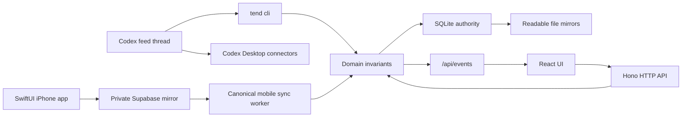

# Architecture

Tend is a local-first Codex-native app. The local executable owns the UI, HTTP API, realtime event stream, JSON CLI, and local state. Codex Desktop remains the agent runtime and uses the local CLI to inspect feeds, claim work, use local connectors, and write results back.

The intended UI surface is Codex Desktop's in-app browser. Each feed has exactly one home Codex
thread beside that UI; the browser is the review surface and the thread is the feed operator.

## Runtime



The current domain model keeps the richest authoring artifacts readable in local file mirrors while moving active runtime records into SQLite. Active feed membership, editable prompt/policy documents, feed cards, routine action groups, source recipes/checkpoints, source run records, sweep state/artifacts, revision records, feed audit events, and work items are now behind repository interfaces with SQLite as the runtime authority and readable files as backup-compatible mirrors.

On Your Mind is a workspace-level contextual layer beside feeds. One bound Chronicle thread
publishes ordered, privacy-filtered updates. Feed runners receive a prompt-safe summary before
collection; the dedicated `/mind` workspace can read the complete filtered observation windows.
Context may focus source work or originate a bounded research question, but independently collected
feed sources remain the evidence boundary.

The installed `tend` executable is the canonical runtime entrypoint. `tend start`
re-launches the same executable in the background with the current `PATH`, `ATTENTION_HOME`, and
port settings. `tend start --foreground` keeps the server attached to the current terminal.
Source development uses the same command tree through `pnpm tend --`. Runtime commands live at the
top level, and agent operations live under `tend cli`. There is no separate runner or second CLI.

## Boundaries

- `server/domain.ts` owns product behavior and invariants.
- `server/workflow/` owns pure workflow rules shared by domain operations, such as approval digests and queued-work construction.
- `server/store.ts` owns current local feed persistence.
- `server/repositories/` owns typed persistence interfaces and adapters.
- `server/runtime.ts` composes SQLite-backed repositories with filesystem mirrors for local execution.
- `shared/types.ts` owns product data contracts used by both server and browser code.
- `server.ts` composes local route modules and starts Bun.
- `server/routes/api.ts` owns browser-facing Hono API routes.
- `server/routes/realtime.ts` owns the SSE event stream.
- `server/routes/assets.ts` owns built UI asset serving.
- `tend.ts` is the sole executable shim.
- `server/cli/` owns runtime, setup, backup, and agent command dispatch.
- `server/cli/operator.ts` owns the JSON agent command surface exposed through `tend cli`.
- `src/router.tsx` owns UI routes such as `/feed/:feedId`, prompt workspaces, and learning review.
- TanStack Query owns workspace fetching and invalidation.
- `src/state/realtime.tsx` hides SSE details behind a provider.
- `src/App.tsx` is the route-level orchestrator for query state, keyboard shortcuts, and mutations.
- `src/feed/` owns feed selectors, card rendering, and routine action rendering.
- `src/workspace/` owns prompt/source editing and learning review surfaces.
- `src/shell/` owns top navigation, the inspector modal, and the voice/work dock.

## Agent Model

Each feed has one home Codex thread. The home thread claims work through `tend cli` before using Gmail, GitHub, Slack, browser, files, or other local connectors. The local app stores recipes and workflow state; connector credentials stay in Codex Desktop.

## Realtime

Realtime is intentionally simple:

```text
mutation commits
→ /api/events emits change
→ RealtimeProvider invalidates TanStack Query
→ UI refetches workspace state
```

No patch stream is required for v0.

## Native Mobile Bridge

The iPhone app is a review client, not a second Tend runtime. One worker inside the canonical Tend
process discovers all active feeds, builds privacy-filtered projections, and replaces the user's
Supabase snapshot in one database transaction. The phone reads those projections and submits
commands through authenticated RPCs.

Each command includes the feed id, feed lifecycle/pass generation, card digest, and action or work
digest where applicable. Supabase rejects obviously stale submissions before enqueueing them; the
local domain validates the same snapshot again before changing SQLite. Durable local command
receipts make retries idempotent after network or worker failures.

Supabase is disposable transport. It does not own passes, cards, approvals, work status, or connector
access. Deleting and rebuilding the cloud mirror cannot change the canonical local workflow state.
