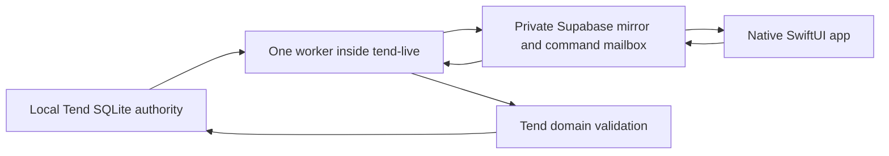

# Native Tend For iPhone

The SwiftUI app under `ios/` provides a fast, feed-by-feed review surface for every feed in the
canonical Tend runtime. The phone never runs Codex or a connector. It reads a private cloud mirror,
records exact commands, and shows the work that the Mac performs later.

## Data Flow



The worker discovers feed membership dynamically. Feed creation, rename, reorder, pass changes, and
removal require no iPhone release. Snapshot replacement is one PostgreSQL transaction, so a phone
cannot observe cards from two different local generations.

## Supabase Project

Create one private Supabase project, then apply the checked-in migration:

```sh
npx --yes supabase@latest login
npx --yes supabase@latest link --project-ref <project-ref>
npx --yes supabase@latest db push
```

In Supabase Auth:

1. Enable email authentication.
2. Configure the email template to include the six-digit `{{ .Token }}`.
3. Create `dan@every.to` before signing in; the app requests OTPs with user creation disabled.
4. Record that user's UUID for the Mac worker configuration.

The migration creates:

- `mobile_feeds`
- `mobile_cards`
- `mobile_mind_snapshot`
- `mobile_commands`
- `mobile_sync_status`

Authenticated users can read only rows matching their auth UUID. They cannot mutate projections
directly. Phone commands enter through `submit_mobile_command`, which validates the mirrored feed,
card, action, and work digests. Service-role-only RPCs replace snapshots and import command progress.

## Canonical Mac Worker

The worker is disabled unless all four required settings exist. Keep them in the owner-only mobile
config loaded by `tend-live`:

```text
~/.config/tend/mobile.env
```

Example:

```dotenv
TEND_MOBILE_SUPABASE_URL=https://YOUR_PROJECT.supabase.co
TEND_MOBILE_SUPABASE_SECRET_KEY=YOUR_SECRET_OR_SERVICE_ROLE_KEY
TEND_MOBILE_USER_ID=THE_AUTH_USER_UUID
TEND_MOBILE_WORKER_ID=canonical-mac
```

Protect the file before starting Tend:

```sh
chmod 600 ~/.config/tend/mobile.env
cd /Users/danshipper/CascadeProjects/attention
./bin/tend-live restart
curl -fsS http://127.0.0.1:4333/api/mobile/status
```

The launcher passes only the config path to its managed process. The secret itself does not appear in
the launch command. Local changes normally mirror within 2.5 seconds; a full reconciliation runs
every 60 seconds.

For an isolated developer runtime, environment variables can be passed directly with a temporary
`ATTENTION_HOME` and temporary ports. Never point a feature worktree at the shared live data.

## Xcode Project

The project is generated from `ios/project.yml` with XcodeGen and targets iOS 17 or later:

```sh
cd ios
xcodegen generate
```

Create `ios/Config/Local.xcconfig` from the checked-in example:

```xcconfig
TEND_SUPABASE_URL = https:/$()/YOUR_PROJECT.supabase.co
TEND_SUPABASE_PUBLISHABLE_KEY = YOUR_PUBLISHABLE_KEY
TEND_ALLOWED_EMAIL = dan@every.to
```

Only the publishable key belongs in the app. Never place the secret/service-role key in Xcode build
settings, source files, `Info.plist`, or `Local.xcconfig`.

Open `ios/Tend.xcodeproj`, select the `Tend` scheme, choose the automatic-signing team, and run on a
simulator or attached iPhone. The bundle identifier is `to.every.tend`.

With no cloud configuration, the app deliberately opens in visible preview mode. UI tests use the
same fixtures through `TEND_USE_FIXTURES=1` or the `-fixtures` launch argument.

## Device Validation

Before enabling all feeds:

1. Sign in with the email code and confirm cached relaunch is immediate.
2. Review Inbox, Company, Every, and one temporary custom feed.
3. Confirm the same card id in two feeds remains isolated.
4. Swipe Archive, use Undo inside five seconds, then archive again.
5. Edit an exact action artifact and verify only that artifact is approved.
6. Use the Monologue system keyboard in Talk or type.
7. Open evidence in the in-app Safari sheet and return to the same review position.
8. Take the Mac offline, submit a command, reconnect, and confirm one import.
9. Change a card or advance its pass before import and confirm a clear stale rejection.
10. Exercise VoiceOver, accessibility text sizes, light and dark mode, and poor connectivity.

Enable production feeds gradually. Supabase can be cleared and rebuilt from local Tend at any time;
never repair canonical workflow state by editing the mobile tables.
