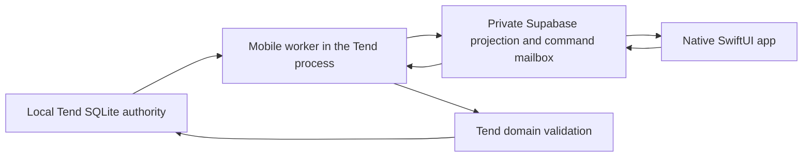

# Tend Mobile Setup

Tend includes an optional native iPhone review app under `ios/`. The Mac remains authoritative:
SQLite owns feed state, the local Tend process projects review-safe data into a private Supabase
project, and the phone submits commands for the Mac to validate and import.

The phone never receives Codex connector credentials, the Supabase secret key, or unfiltered
Chronicle material.

## Data Flow



The worker discovers feeds dynamically. Creating, renaming, reordering, or archiving a feed does not
require a new iPhone build. Supabase is disposable transport and can be rebuilt from the Mac.

## Requirements

- A Mac with a healthy Tend runtime using the same default `~/.attention` home as future packaged
  binaries
- A source checkout with the [core development requirements](./INSTALL.md#source-and-binary-builds):
  Bun 1.3.11 or newer, Node.js 22 or newer, and pnpm 9.15.4
- A private [Supabase project](https://supabase.com/docs/guides/getting-started) with access to its
  Auth settings and API keys
- Xcode capable of building the iOS 17 target
- [XcodeGen](https://github.com/yonaskolb/XcodeGen)
- An [Apple Account added to Xcode](https://developer.apple.com/support/compare-memberships/) for
  code signing
- A physical iPhone running iOS 17 or later, or an iOS simulator

A free Xcode Personal Team can install Tend on your own device for personal testing. Join the
[Apple Developer Program](https://developer.apple.com/programs/) when you need TestFlight, App
Store, or other shared distribution.

[Docker](https://docs.docker.com/get-started/get-docker/) is required only for the local Supabase
stack and bridge integration tests under [Validation Commands](#validation-commands). It is not
required when the Mac worker and iPhone app use a hosted Supabase project.

Install repository dependencies and XcodeGen:

```sh
pnpm install
brew install xcodegen
```

## 1. Create The Supabase Project

Create a private project, then authenticate the pinned Supabase CLI and apply the checked-in
migration:

```sh
pnpm exec supabase login
pnpm exec supabase link --project-ref <project-ref>
pnpm exec supabase db push
```

The migration creates:

- `mobile_feeds`
- `mobile_cards`
- `mobile_mind_snapshot`
- `mobile_commands`
- `mobile_sync_status`

Authenticated users can read only rows matching their auth UUID. They cannot mutate projections
directly. Phone commands enter through `submit_mobile_command`, which validates feed, card, action,
and work digests. Service-role-only RPCs replace snapshots and import command progress.

## 2. Configure Passwordless Sign-In

In **Supabase Dashboard > Authentication > URL Configuration**, set:

```text
Site URL:      to.every.tend://auth-callback
Redirect URL:  to.every.tend://auth-callback
```

Keep email authentication enabled. Tend uses Supabase magic links, not a typed numeric code. The
default magic-link email template is sufficient.

The app requests links with user creation disabled. In **Authentication > Users**, create and
confirm the one email address that should use this private app. Record its user UUID for the Mac
worker.

For a single-user deployment, disable public signups. The checked-in local Supabase configuration
does this already.

## 3. Configure The Mac Worker

Create an owner-only config outside the repository:

```sh
mkdir -p ~/.config/tend
touch ~/.config/tend/mobile.env
chmod 600 ~/.config/tend/mobile.env
```

Add:

```dotenv
TEND_MOBILE_SUPABASE_URL=https://YOUR_PROJECT.supabase.co
TEND_MOBILE_SUPABASE_SECRET_KEY=YOUR_SECRET_OR_SERVICE_ROLE_KEY
TEND_MOBILE_USER_ID=THE_AUTH_USER_UUID
TEND_MOBILE_WORKER_ID=your-mac
```

Use the Supabase secret or legacy service-role key here. Never put it in Xcode, Git, or the phone
app. Tend rejects this file unless it is owned by the current user and has mode `400` or `600`.

Restart the canonical runtime:

```sh
pnpm build
pnpm tend -- restart
pnpm tend -- health
curl -fsS http://127.0.0.1:4332/api/mobile/status
```

For a packaged install, use the same commands without the pnpm prefix:

```sh
./tend restart
./tend health
```

Both source and packaged Tend use `~/.attention` by default, so a future binary reuses the same
feeds and mobile projection. Set `ATTENTION_HOME` only for deliberately isolated development or
tests.

The worker watches for changes every 2.5 seconds and performs a full reconciliation every 60
seconds. A healthy status response reports mobile sync enabled, recent push and pull timestamps,
and no error.

## 4. Configure The iPhone App

Copy the ignored local build configuration:

```sh
cp ios/Config/Local.xcconfig.example ios/Config/Local.xcconfig
chmod 600 ios/Config/Local.xcconfig
```

Fill in:

```xcconfig
TEND_SUPABASE_URL = https:/$()/YOUR_PROJECT.supabase.co
TEND_SUPABASE_PUBLISHABLE_KEY = YOUR_PUBLISHABLE_KEY
TEND_ALLOWED_EMAIL = you@example.com
```

The unusual `https:/$()/` spelling is required because xcconfig treats `//` as a comment. Xcode
expands it to a normal `https://` URL.

Only the publishable key belongs in the app. Never place a secret or service-role key in
`Local.xcconfig`, source files, build settings, or `Info.plist`.

Generate the Xcode project:

```sh
cd ios
xcodegen generate
```

Open `ios/Tend.xcodeproj`, select the `Tend` scheme, choose your automatic-signing team, select the
attached phone, and press Run. The bundle identifier and callback scheme are both based on
`to.every.tend`.

With no cloud configuration, Tend deliberately opens in visible fixture mode. UI tests use the same
fixtures through `TEND_USE_FIXTURES=1` or the `-fixtures` launch argument.

## 5. Sign In And Verify

1. Open Tend on the phone.
2. Enter the pre-created email address.
3. Tap **Email me a sign-in link**.
4. Open the link on that phone. Safari should return directly to Tend.
5. Confirm the feed list and **On Your Mind** show the same current projections as the Mac.
6. Submit a harmless local command, such as Archive followed immediately by Undo, and confirm
   Activity records the round trip.
7. Relaunch the app and confirm the Keychain-backed session restores without another email.

Magic links are one-time use and rate limited. Avoid repeatedly requesting links while debugging;
use **Send the link again** only after the previous request has expired or failed.

## Validation Commands

Run the server and mobile bridge checks:

```sh
pnpm typecheck
pnpm lint
bun test test/mobile-sync.test.ts test/mobile-projection.test.ts
pnpm exec supabase start
pnpm exec supabase db reset --local
pnpm exec supabase test db
```

Run the real round-trip bridge integration against that local stack:

```sh
eval "$(pnpm exec supabase status -o env)"
TEND_SUPABASE_E2E=1 \
TEND_TEST_SUPABASE_URL="$API_URL" \
TEND_TEST_SUPABASE_ANON_KEY="$ANON_KEY" \
TEND_TEST_SUPABASE_SERVICE_ROLE_KEY="$SERVICE_ROLE_KEY" \
TEND_TEST_SUPABASE_JWT_SECRET="$JWT_SECRET" \
bun test test/mobile-supabase-e2e.test.ts
pnpm exec supabase stop --no-backup
```

Run the native tests from Xcode, or from the command line with an available simulator:

```sh
cd ios
xcodegen generate
xcodebuild \
  -project Tend.xcodeproj \
  -scheme Tend \
  -destination 'platform=iOS Simulator,name=iPhone 16 Pro' \
  test
```

CI also starts local Supabase, resets and pgTAP-tests the database, runs the real mobile bridge
integration test, generates the Xcode project, and runs the native unit and UI targets.

## Troubleshooting

### The Email Link Opens Safari But Not Tend

Confirm all three values are exactly `to.every.tend://auth-callback`:

- Supabase Site URL
- Supabase redirect allowlist
- the URL scheme in the generated Tend app

Regenerate the Xcode project after changing `ios/project.yml`.

### The App Shows Fixtures

The built app is missing a valid Supabase URL or publishable key. Recheck
`ios/Config/Local.xcconfig`, especially the `https:/$()/` URL syntax, then rebuild.

### The App Signs In But Shows No Feeds

Check:

```sh
pnpm tend -- health
curl -fsS http://127.0.0.1:4332/api/mobile/status
```

Confirm `TEND_MOBILE_USER_ID` matches the authenticated Supabase user UUID and that the worker has
completed a successful push.

### Tend Rejects The Worker Config

Check ownership and permissions:

```sh
ls -l ~/.config/tend/mobile.env
chmod 600 ~/.config/tend/mobile.env
```

Only the four documented keys are accepted. Explicit environment variables override values from
the file.

## Security Boundary

- SQLite on the Mac is authoritative.
- Supabase stores a private, review-safe projection and command mailbox.
- The phone stores only the publishable key and a Keychain-backed user session.
- The Mac alone holds the Supabase secret key.
- Every imported command is validated again against current local state.
- External connector mutations still require Tend's visible approval and fresh `action:verify`.

Never repair canonical workflow state by editing mobile tables directly. Clear and rebuild the
Supabase projection instead.
